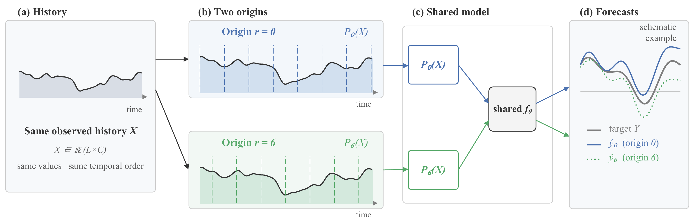

<div align="center">

# Same Observations, Different Forecasts

### Partition-Origin Sensitivity in Patch-Based Time-Series Forecasting

<p>
  <a href="https://github.com/haoming-yang/partition-origin-sensitivity">
    
  </a>
  <a href=".github/workflows/tests.yml">
    
  </a>
  <a href="environment.yml">
    
  </a>
  <a href="environment.yml">
    
  </a>
  <a href="LICENSE">
    
  </a>
</p>

<p><strong>A controlled study of one overlooked coordinate choice in discrete time-series representations.</strong></p>

</div>

Code and configuration for the paper **“Same Observations, Different
Forecasts: Partition-Origin Sensitivity in Patch-Based Time-Series Forecasting.”**

The repository studies whether changing only the origin of a one-dimensional
patch lattice can change a forecast when the observed history, target, and
forecasting model are fixed.

<p align="center">
  
</p>

<p align="center"><em>Figure 1. Same observations, different partition origins, and different forecasts from a fixed model.</em></p>

The current anonymous manuscript PDF is available as
[`docs/manuscript.pdf`](docs/manuscript.pdf). This repository also includes the
frozen, compact diagnostic artifacts used by the latent-representation
analyses; it does not include datasets, checkpoints, or full prediction dumps.

## What is included

- the canonical five-dataset origin-sensitivity protocol;
- controlled extensions for optimization, training-origin policy, overlap,
  horizon 192, patch length, positional encoding, and the official PatchTST
  adapter;
- read-only token-axis spectrum and layerwise diagnostics for frozen controlled
  Transformer checkpoints, plus a protocol-adapted PatchTST diagnostic;
- the saved per-window diagnostic differences and the three-replicate permutation
  audit used to test the spectral--forecast association against random pairing;
- the patching, masking, evaluation, and formal metric implementations;
- isolated third-party model snapshots used by the native source audit;
- configuration files and audit tools for checking protocol behavior.

The repository does not include datasets, checkpoints, or full prediction
dumps. Historical results that depend on unavailable training artifacts are
identified in the
[experiment matrix](docs/experiment_execution_matrix.md); they are never
silently replaced by a new run.

## Install

The public environment specification is in [environment.yml](environment.yml).
For a Conda installation:

```bash
conda env create -f environment.yml
conda activate partition-origin-sensitivity
python -m pip install -r requirements.txt
```

Put the public datasets under `data/`, or set `DATA_ROOT` to an external data
directory. The expected layout and split definitions are documented in
[data/README.md](data/README.md).

## Verify the checkout

The following checks do not train a model and do not require datasets:

```bash
python -m pip install -r requirements-dev.txt
python -m pytest -q
python -m src.run --config configs/core/canonical.yaml --seeds 42,43,44 --dry-run
bash scripts/smoke_test.sh
```

The smoke script performs protocol tests, a dry-run, reconstruction checks,
and padding-sentinel checks. The separate native source smoke check performs
import/forward validation only:

```bash
bash scripts/run_tier1_smoke.sh
```

For the shortest end-to-end entry point, validate the canonical configuration
without starting training:

```bash
python -m src.run --config configs/core/canonical.yaml --seeds 42,43,44 --dry-run
```

To start that registered experiment after placing the datasets under `data/`:

```bash
python -m src.run --config configs/core/canonical.yaml --seeds 42,43,44
```

Each completed run writes its configuration, training and validation logs,
per-origin metrics, summary, provenance, and checkpoints below `outputs/`.
The summary and provenance record the Git commit used for the run.

## Reproduce experiments

After the datasets are available, use the explicit entrypoints below. Training
starts only when one of these commands is selected.

The default replicate seeds used for the paper are 42, 43, and 44. They define
the default reproducibility set and can be overridden through the `SEEDS`
environment variable or the `--seed`/`--seeds` parameters.

```bash
bash scripts/run_core.sh
bash scripts/run_overlap.sh
bash scripts/run_h192.sh
bash scripts/run_training_policy.sh
bash scripts/run_patch_length.sh
bash scripts/run_patchtst.sh
```

These controls are intentionally separate from the historical paper records:

```bash
bash scripts/run_optimization.sh
bash scripts/run_heads.sh
bash scripts/run_pe_control.sh
bash scripts/run_poc.sh
```

See [docs/experiments.md](docs/experiments.md) for the experiment-to-code
map, [docs/reproducibility.md](docs/reproducibility.md) for metric and
provenance details, and [docs/source_audit.md](docs/source_audit.md) for the
source-availability boundary.

Reproduction has three levels in this release. The canonical, overlap,
horizon, training-policy, PatchTST, and patch-length runners can generate new
runs after the public datasets are supplied. The optimization, mask-head, and
no-PE entries are reconstructed controls and must not be used as replacements
for frozen historical values. The full-split mixer comparison and the POC
schedule remain artifact-only or artifact-dependent; their exact historical
training inputs are not redistributed.

## Latent-representation diagnostics

The diagnostic scripts are post-hoc and read-only: they compare origin 0 and
origin 6 on the same ETTh1 test windows using frozen checkpoints. They do not
retrain a model. The controlled Transformer tools retain only fully observed
patch tokens, apply the FFT along the ordered token axis (never the embedding
axis), and save per-window spectral and forecast discrepancies. The
Protocol-Adapted PatchTST tool preserves its raw-scale, mask-aware adapter
protocol, so its values are not numerically interchangeable with the
standardized controlled-Transformer values.

```bash
python tools/analyze_latent_spectrum.py \
  --checkpoint /path/to/checkpoint.pt --data-root /path/to/data \
  --seed 42 --output artifacts/latent_spectrum_etth1_o0_o6_p12_L512_H96

python tools/analyze_latent_layers.py \
  --checkpoint /path/to/checkpoint.pt --data-root /path/to/data \
  --seed 42 --output artifacts/latent_layers_etth1_o0_o6_p12_L512_H96

python tools/analyze_patchtst_latent_spectrum.py \
  --checkpoint /path/to/patchtst_checkpoint.pt --data-root /path/to/data \
  --seed 42 --output artifacts/patchtst_latent_spectrum_etth1_o0_o6_p12_s12_L512_H96

bash scripts/summarize_latent.sh
```

The repository retains the frozen appendix PCA coordinates and the matching
PDF asset as release artifacts. The PCA generator is intentionally not a
reproduction entry point: it was a one-off qualitative diagnostic, not a
repeated aggregate analysis.

The checked-in artifact directory names retain seed identifiers as reproducibility
keys. The prose uses replicate terminology so these identifiers are not read as
additional scientific conditions.

New analysis runs place results under a seed-specific subdirectory such as
`seed42/`. CSV names contain only the analysis purpose and its hyperparameters;
the seed is recorded in the file contents and summary metadata.

The summary wrapper aggregates existing replicate CSV records into JSON and
runs the optional random-pairing audit. It performs no model run and does not
render a new figure. Override the replicate set with, for example,
`SEEDS=42,43,44 bash scripts/summarize_latent.sh`.

The wrapper accepts both the current seed-subdirectory layout and the legacy
frozen artifact layout committed in this repository.

The test holds forecast discrepancies fixed and randomly permutes the paired
token-spectrum discrepancies across windows. It assesses random pairing, not
causal mediation.

## Repository layout

```text
artifacts/                Frozen compact records, including frozen-checkpoint PCA coordinates; no predictions
configs/                  Protocol configurations
data/                     Dataset layout instructions; data is ignored
docs/                     Reproduction, source, and experiment documentation
scripts/                  Training and reproduction entrypoints
src/analysis/             Token-spectrum, layerwise, and PatchTST latent helpers
src/                      Core runners, patching, evaluation, and metrics
tests/                    Fast protocol, analysis, and release-contract tests
third_party/              Isolated source snapshots with provenance notices
tools/                    Static audits and read-only post-hoc diagnostics
```

## Citation and license

If you use this repository, cite the paper using [CITATION.cff](CITATION.cff).
Repository-level code is released under the MIT License. Files under
`third_party/` retain their upstream provenance and licensing requirements;
see [docs/THIRD_PARTY.md](docs/THIRD_PARTY.md).
