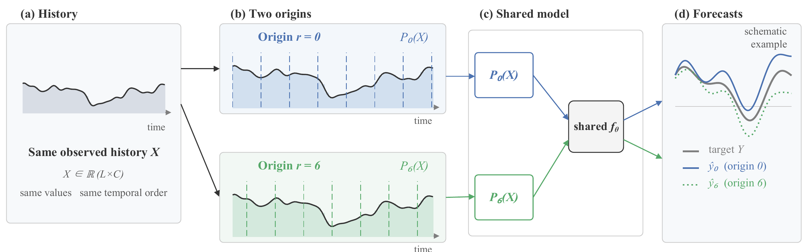

# Partition-Origin Sensitivity

This repository contains code, configurations, and compact records for studying
whether changing only the origin of a fixed patch lattice changes forecasting
results when the observed history and target are unchanged. It includes runnable
protocol checks and experiments, plus frozen evidence for analyses whose exact
original inputs are not all available.

The illustration below is conceptual: it shows how the same observations can be
assigned to different patches and produce different forecasts from a fixed model.

<p align="center">
  
</p>

## Quick Start

The default reviewer path uses Python 3.11 on CPU. From the repository root,
create and activate a Python 3.11 environment, then install the pinned CPU
PyTorch build and development requirements:

```bash
python -m venv .venv
# Activate .venv using the command for your shell.
python -m pip install --upgrade pip
python -m pip install torch==2.5.1 torchvision==0.20.1 torchaudio==2.5.1 --index-url https://download.pytorch.org/whl/cpu
python -m pip install -r requirements-dev.txt
```

Ensure that the active `python` command refers to Python 3.11.

Run the fast checks. They do not require datasets, checkpoints, or a GPU:

```bash
python -m pytest -q
python -m src.run --config configs/core/canonical.yaml --dry-run
bash scripts/smoke_test.sh
bash scripts/run_tier1_smoke.sh
```

The smoke checks use synthetic or model-specific inputs; they verify execution
and protocol behavior, not paper-scale training results. For the CUDA reference
environment, see [`environment.yml`](environment.yml). It is not the default
installation path.

## Reproducing results

The paper's default replicate seeds are **42, 43, and 44**. Override them with
`--seed`/`--seeds` or, for supported shell wrappers, the `SEEDS` environment
variable. Outputs are written under `outputs/` by default. The directory
[`artifacts/`](artifacts/) contains frozen historical evidence and is not a
destination for new runs.

To validate the canonical configuration without training:

```bash
python -m src.run --config configs/core/canonical.yaml --seeds 42,43,44 --dry-run
```

After placing the five public CSV datasets in the layout described by
[`data/README.md`](data/README.md), start the canonical experiment:

```bash
python -m src.run --config configs/core/canonical.yaml --seeds 42,43,44
```

This launches 15 training jobs. It is a full experiment, not a smoke test.
Other registered experiment entrypoints and their configurations are listed
in [`docs/experiments.md`](docs/experiments.md). For a result-by-result mapping
from the paper to commands, configs, outputs, tolerances, and reproduction
status, use [`docs/reproduction_map.md`](docs/reproduction_map.md).

Frozen summaries and summaries of newly generated runs can be produced with:

```bash
bash scripts/reproduce_tables.sh frozen
bash scripts/reproduce_tables.sh new-runs
```

These commands write generated files under `outputs/`; they do not overwrite
the tracked evidence in `artifacts/`. The frozen path recomputes summaries from
archived records, while `new-runs` aggregates results already present in the
output tree. Neither command by itself reruns model training.

To also render the archived diagnostic visualization, use the supported
`--figure` option and choose an output directory:

In Bash-compatible shells:

```bash
MPLBACKEND=Agg python tools/reproduce_frozen_paper.py --output outputs/paper_reproduction --figure
```

## Reproduction boundaries

Not every historical result can be regenerated from this checkout. Some
analyses require datasets or checkpoints that are not included; some historical
controls are available only as frozen records or are explicitly marked as
reconstructed controls. Missing inputs stop the corresponding run rather than
triggering a substitute experiment. The reproduction map and
[`docs/reproducibility.md`](docs/reproducibility.md) describe these boundaries,
the recorded protocols, and the expected sources of numerical variation.

The frozen POC selection protocol uses a **1% validation-error eligibility
slack**. All archived candidates also satisfy the stricter zero-slack condition,
so the selected value remains **\(\lambda=1.0\)**. The historical protocol and
selection records are preserved; this README does not redefine them. See
[`configs/poc/README.md`](configs/poc/README.md) for the detailed POC protocol
and input requirements.

## Diagnostics and data

Post-hoc representation diagnostics use frozen checkpoints and require the
matching data and checkpoint files. They do not retrain models. Their commands,
input scales, token filtering, output schemas, and artifact-dependent limits are
documented in the [reproduction map](docs/reproduction_map.md) and
[reproducibility guide](docs/reproducibility.md).

Datasets are not included. Put the CSVs under `data/` or set `DATA_ROOT` to an
external data directory. The expected paths, split definitions, and window
counts are documented in [`data/README.md`](data/README.md). Dataset licenses
should be checked at their respective sources before redistribution.

## Repository layout

```text
artifacts/       Frozen compact records and provenance; do not use for new outputs
configs/         Experiment and protocol configurations
data/            Dataset layout instructions; datasets are not included
docs/            Reproduction maps, experiment notes, and provenance guidance
scripts/         Training, smoke-test, and summary entrypoints
src/             Core runners, patching, evaluation, and metrics
tests/           Protocol, analysis, and release-contract tests
third_party/     Isolated upstream source snapshots and license notices
tools/           Audits, post-hoc diagnostics, and historical protocol helpers
outputs/         Default destination for generated runs and summaries (Git-ignored)
```

## Further documentation

- [Experiment descriptions and entrypoints](docs/experiments.md)
- [Paper-result reproduction map](docs/reproduction_map.md)
- [Reproducibility and provenance](docs/reproducibility.md)
- [Source availability and audit boundaries](docs/source_audit.md)
- [Execution status matrix](docs/experiment_execution_matrix.md)
- [Dataset paths and split protocol](data/README.md)
- [POC protocol and required inputs](configs/poc/README.md)
- [Third-party licenses](docs/THIRD_PARTY.md)

## Citation and license

Citation metadata is provided in [`CITATION.cff`](CITATION.cff). Repository
code is released under the MIT License. Files under `third_party/` retain their
upstream provenance and licensing terms; see [`docs/THIRD_PARTY.md`](docs/THIRD_PARTY.md).
